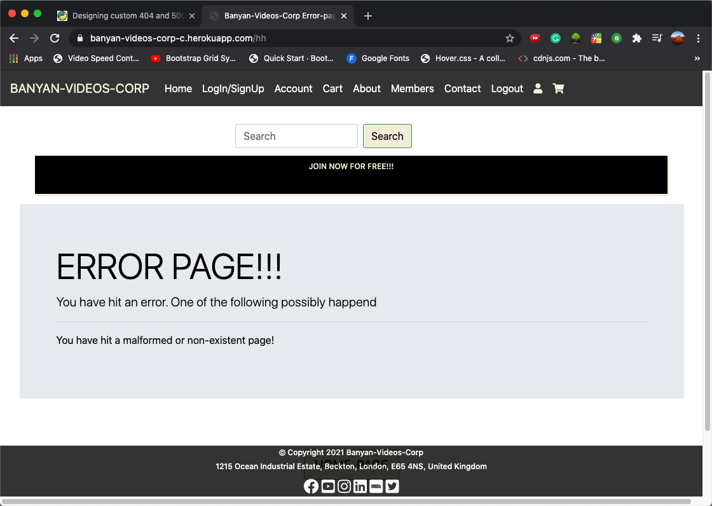
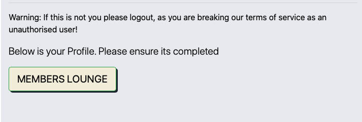
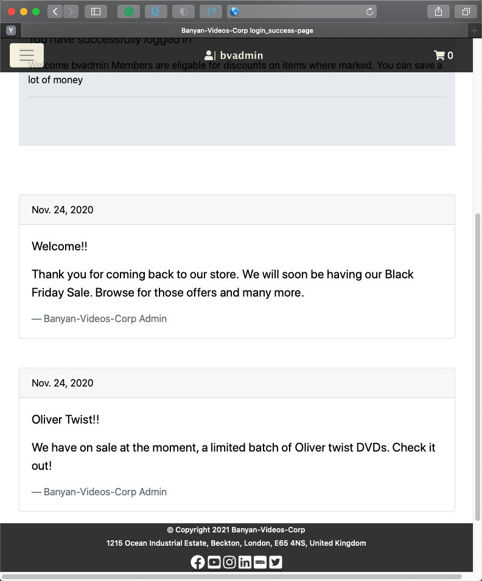
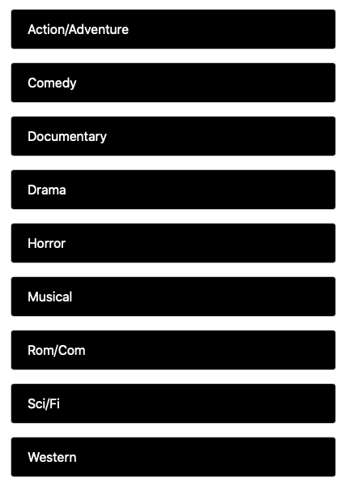
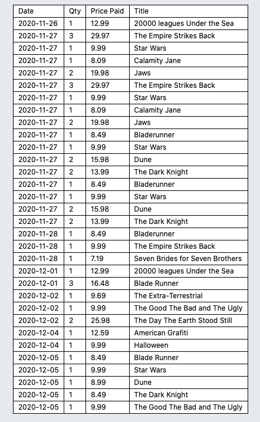
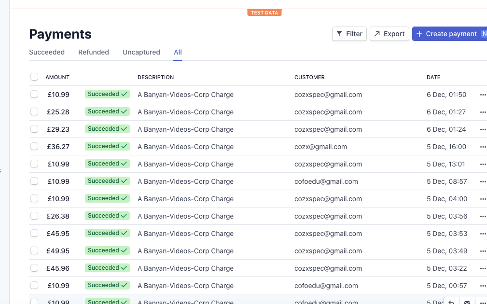
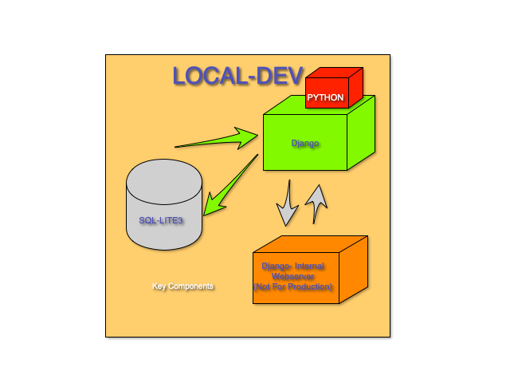
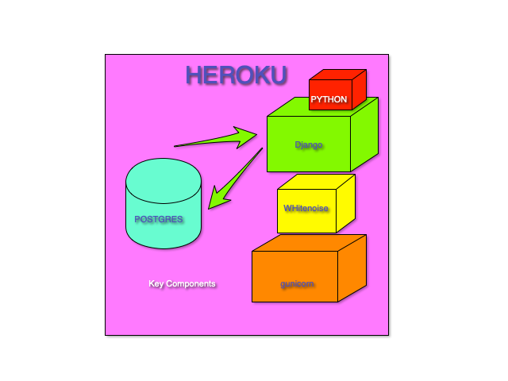

# BANYAN-VIDEOS-CORP-C
BANYAN-VIDEOS-CORPORATION-C

 Live Site Link:

 https://banyan-videos-corp-c.herokuapp.com/

GitHub Link:

https://github.com/cofoeducistudent/BANYAN-VIDEOS-CORP-C

|Screen|Size|
|------|----|
||* Mobile First - Small Screen |

**USERS CONFIGURED FOR TEST**

|User Name|Password|Role|
|---------|--------|----|
|bvcsiteadmin|Bvc2020$|Staff
|bvcmemberuser|Bvcuser2020$| Active - Member User

 

## Index ##
>[Project Brief](#projectbrief)

>[1. Ux](#ux)

    a. Strategy

        Potential Users
        User stories

    b. Scope

        Specific users identified

    c. Structure

        Database Models

    d. Skeleton

    e. Surface

        Colour scheme

>[2. Features](#features)

    Feature Table
    Maintainable features by site admin

    a.  Existing Features
    b.  Payment Gateway

    Features Left to Implement

>[3. Technologies Used](#technologiesused)

    Hardware
    Software Tools Used
    Web-Tech Used

>[4. Testing](#testing)

>[5. Deployment](#deployment)

    Local install
        
        Folders

    Heroku Install
    Environment Variables

>[6. Credits](#credits)

>[7. Content](#content)

>[8. Media](#media)

>[9. Acknowledgements](#acknowledgements)
 

><a id="projectbrief">Project Brief</a>

[<< Back](#top)

**Banyan-Videos-Corporation - project brief**.

Banyan videos corporation has asked for a website but will help them retail their video merchandise online.

For this reason, they have provided a brief stating what they would like to see on the site with features that they would wish on it.

* The site will be of a light colour scheme be and corporate like (Flash etc).

* The Front page should have a search facility allowing users to search for products

* It should have a carousel showing a selection of film products for sale

* It should show news/information which banyan videos deem fit. This is not expected to be an RSS-feed or an integrated feed from other sites, but a section allowing banyan video administrators to post corporate messages and news.

* On the members-only section, there should be more article links to other important news on the web (curated by banyan videos admin). This should have a title/description, a picture, all linkable to the source material.

* The colour theme should be straightforward and simplistic, and the appearance of the site should be predominantly light and clean.

* The frequency and volume of the products will be centrally controlled and updated infrequently. Therefore, they wish to have a way of populating the product line very quickly. This will ensure prices and sale discounts are also effectively controlled. The intention is for head Office (H.O) to connect to the server via an administrator access, upload the data every so often. BVC do not wish to have a CMS for creating items(except in odd circumstances), as that will redact a central control model and lead to chaos and potential fraud.

* In the future, they wish to have a separate server to serve images for their products, which will have a commercial uniform asset look, like significant retailers such as Argos or Sainsbury's. However, the division that will handle that is not yet up and running. For this reason, they simply wish to use images that are readily available online showing the video covers. These images are owned by the movie production companies and placed in the public domain for promotion. Banyan videos corp will be purchasing their videos from their leading distributors, thus avoiding copyright infringement or legal entanglements.

* Videos film products should also be presented on the site within specific genre or classification for quick search if a customer does not know a particular title of a film but has an idea of the flavour of film they wish to purchase.

* Various Video films will be discounted to members.

* For members, there should be a member's area, where banyan videos will post inside news and features, and watch trailers or any sneak peek teasers posted.

* Banyan videos say that they have a corporate head office (H.O) that will deal with all issues from customers, and therefore it is sufficient to have a contacts page that provides a contact form. 

* Finally, they wish the website to be up and running quickly & cheaply.

> # <a id="ux">1. UX</a>

[<< Back](#top)

**a. Strategy**
 
Following the project brief and further clarification, I have decided to approach that will facilitate banyan videos requirements in the following way.

* The site will be built using a framework for the benefit of speed. I will implement the site using the Django framework.

* The finished site will be hosted initially on the HEROKU platform. I expect the site will be migrated to banyan corporations own hosting service as a future date. 

* Although the Django framework defaults to an SQL-light database, I will utilize the POSTGRES SQL relational database management system (RMDBS) hosted on HEROKU.

* In addition using Django will allow me to create the database items in abstracted format (models), therefore if banyan Corporation choose to change databases in the future it will be reasonably easy to implement.

* I am not quite sure of the colour scheme to use yet, as banyan videos left this open-ended, however having seen some of their logo artwork, I will endeavor to use something in a similar style.

* For e-commerce and commerce aspects, I will employ the "Stripe-Payment" solution. The benefit of this is that the security will be inherently strengthened, as user payment credit card (CC)details will be handled entirely by the "STRIPE Corporation" and not reside within our website architecture. Although the Django framework defaults to an SQL-light database, I will utilize the POSTGRES SQL relational database management system (RMDBS) hosted on HEROKU.

* Banyan videos say that they have a corporate head office (H.O) that will deal with all issues from customers, and therefore it is sufficient to have a contacts page that provides a contact form. 

**Potential Users**

I have identified some potential users of the site and have classified them as:-

|User Type|Ability|
|---------|-------|
|Owner|Banyan Videos Corp - Online Retailer of fine videos|
|Administrator - level|The administrator will be able create and post material to the site. In addition, there will also be able to populate the site with new products.|
|Customer(Registered) - level|Registered users will have access to browse the site make purchases, have their details on the profile page for speedier purchases, and have the ability to access a member’s page, on which they can view video clips and specific articles set up by banyan videos. Finally, members will have access to discounted prices on products they purchase|
|Customer(Anonymous) - level|An anonymous user, or a new user to the site will have the ability to browse the site and purchase products. However, it will not have the benefit of discounted prices, or access to the members area|

**USER STORIES**

Basic user stories supported the features

|User| Requirement|So that I can Achieve|
|----|------------|----------------------|
|Owner|I require a sales banner|So that I can present the merits/products/offers of our site to customers|
|Owner|I require the ability to send a file of our products to a site admin| So that they could upload it to the site, and I retain control of the prices and discounts|
|Owner|I require a membership join feature| So I can build a customer base and communicate with customers|
|Owner|I require a membership video/trailer clip ability| So I can offer members video clips and trailers or premium content|
|Owner|I require a membership News/Snippets feature|So I can provide premium content to members|
|Owner|I wish a selective discount feature on products|So that I can give discounts to signed-up Members, thus providing an incentive|
|Administrator|I require a login feature| So that I can login to the site and carry out my tasks|
|Administrator|I require an upload feature/process |So I can update the product database in bulk|
|Customer|I require a feature |So I can update the product database|
|Customer|I require a registration/Login page|So that I can register or login to my account|
|Customer|I require a search feature|So I can search for products I wish|
|Customer|I require a simple purchase facility|So I can purchase Items|
|Customer|I require a purchase_history|So I can review what I bought and spent|
|Customer|I require a shopping cart feature| So I can add items and pay once I have completed browsing|
|Customer|I wish to register my address & email|So I can receive my order and a confirmation receipt|
|Customer (Anonymous)|I wish purchase ability without membership|So I can purchase without becoming a member|
|Customer|I wish a credit card payment feature| So that I can pay by credit card|
|Customer|I wish for a contact feature| So that I can mail the company if I have any issues|
|Customer|I require a Logout feature| So I can safely logout of the site|

**b. Scope**

- Therefore, the scope of the project will involve the following:

- The design and creation of a site to allow banyan videos corporation to post the video assets for purchase by the general public.

- The design will be of a clean and corporate style

- Initial data to support the site. (The Banyan Videos Corp may replace these to match their catalogue)

**Three specific users have been identified**

* Administrator 

* Registered user
* Anonymous user

**Scope Summary**

- The sites will offer discount prices to registered users

- The site will allow new customers membership sign-up

- The site will allow members to access a member’s section, where they will view members-only content

- Members will have the ability to complete a profile page to speed up future transactions.

- Video products on the site will be categorized by genre.

- Visitors to the site can search for products either by genre or by text on a search bar

- The site will be designed (** mobile-first **) and fluid, allowing it to adjust on mobile phones tablets and desktop computers.

- From technical aspects of meeting development speed, the site will be created user Django framework.

- The database will be the Postgres SQL relational database.

- The administrator will have access to the backend to update a "FILE" containing new products catalogue

- Initially, the site will be hosted on the "HEROKU platform". It is understood it may be re-hosted on some other platform in the future.

 

>**c. Structure**
 
**DATABASE MODELS**

* Django uses the concept of models to abstract data-content and data-structure from the "database type".

* This is fantastic, and it allows the developer to not worry about the specificity of databases. The developer can remain certain it will be easy to port the application to whatever database engine the client requires!

* A few database models were created to allow the Django website to function 

* A **'Foreign-Key'** is used between video films and video-film-genre, creating a relationship

Here is an ERP diagram. This shows the basic grouping and relationship of the various models and forms

* Green - product and product grouping, linked with a foreign Key
* Yellow - shopping/transaction grouping
* Blue - published content group  (general and members only )
* Red - Communications group content ( forms)

|Model|Purpose|Model Implementation|
|-----|-------|--------------------|
|homepage-models|Front page Carousel / Article / Snippets||
|my-account-models|User Profile details / User Purchase History ||
|search-results-models|Film Video models / Genre models ||
|shopping-cart models-models|shopping-cart models ||
|contact-form-models|contact-form models ||
|checkout-form-models|checkout-form models ||

 

>**d. Skeleton**

I created mock-ups for the site pages. However, when they were built and tested, I was not comfortable with all of them. So, some were changed to their final incarnation. From that, I learnt that what looks good on paper does not always translate

| Index.| Page | Mock-up|Final|
|-------|--------|------|-----|
|A|Homepage|||
|B|Login/SignUp|||
|C|Login page|||
|D|Register page|||
|E|Account profile page|||
|F|Search Results page|||
|G|Members Area page|||
|H|Contact page|||
|I|Logout page|||
|J|Cart page|||
|K|Payments page|||
|L|Shipping Details page|||
|M|ErrorPage||

>**e. Surface**

**Colour Scheme**

The colour scheme I settled on is as follows. As directed, I tried to make it light and airy, clean and simple

|Colour Scheme|
|-------------|
||
||

Aesthetics

The **Bootstrap** class was used for the buttons and forms, giving them a consistent rounded edge look.
The **Crispy Forms** module was use to beautify the forms within the various apps.

># <a id="features">2. Features</a>

[<< Back](#top)

The website will contain a few features. Some have been explicitly requested by Banyan Videos Corporation (BVC), and the others have been implicitly added as part of the design process

**Feature Table**

|No.|Feature|Requested|Implicit|Purpose|
|---|-------|---------|------------------|-------|
|1|Carousel on front page|Yes|-|Show selection of video films available|
|2|Search bar|Yes|-|Search for selection of video films available|
|3|Genre Search|Yes|-|Search video films available by genre|
|4|Add Banner|Yes|-|Present cycling promotion messages from BVC|
|5|Right-Side Article block|Yes|-|Present articles from BVC|
|6|Navigation Bar|-|Yes|Navigation Bar Presenting Site Links Uniform-ally |
|8|Classified Advert Block|Yes|-| A advert block space - holding paid classified adverts|
|9|News Snippets|Yes|-| Provides News Snippets Links jump-off to external sources|
|10|Members Sections|Yes|-| Provides members only space containing messages,articles,competitions|
|10|Member Discounts Only|Yes|-| Intrinsic facility allowing product discount for members only|

**Maintainable features by site admin**

As an administrator tasked with installing / maintaining the site. You can change features en-masse by accessing the server command line interface and then running these command processes.

* The 'add-banner' is a javascript file. simply open it up and type.

**Logged in as administrator:**

|Install Type|Action|
|------------|------|
|* After logging in to HEROKU| ----- HEROKU run python manage.py loaddata ---'server-file'|
|* Local install| python manage.py loaddata --- 'server-file'|

|Server File - Feature|User|Purpose|Mode|Server Sides - Folder|
|-------|----|-------|----|---------|
|Add Banner / core.js|Administrator|Generic promotion Message - Changed infrequently|Administrator| home -> templates ->static -> js|
|genre.json|Administrator|Film Genre for Film Catalogue|Administrator|search_results -> fixtures -> genre.json|
|films.json|Administrator|Film Catalogue|Administrator|search_results -> fixtures -> films.json|
|-|-|-|-|-|
|article.json|Administrator|Articles on front page of site|Administrator|home -> fixtures -> article.json|
|frontpagecarousel.json|Administrator|Carousel on front page of site|Administrator|home -> fixtures -> frontpagecarousel.json|
|snippet.json|Administrator|snippets/news on members section of site|Administrator|home -> fixtures -> snippet.json|

>**Existing Features**

[<< Back](#top)

Here are the features that has been implemented on the site

|No.|Feature|Implemented|
|---|-------|---------|
|1|**Member Discount**||
|2|**Front Page Carousel**||
|3|**Articles**||
|4|**Members Area**||
|4|**Members Snippets/News**||
|5|**Login Messages**||
|6|**Search For films**||
|7|**Genre Film Search**||
|9|**Advert Banner**||
|10|**Purchase History** (Note this is the minified view. The Desktop view has images ||

**PAYMENT GATEWAY**

STRIPE is a payment solution which I have implemented on the site.
The benefit of using stripe is that I do not have to hold any of the users card payment details within the site. Stripe provides an abstraction layer which makes the site compliant with online and banking payment industries.

For development purposes all the payments are test and not real

https://dashboard.stripe.com/test/dashboard

**Features Left to Implement**

* Most of the features expected have been implemented. However for the film models a field was left for global sales.The intention was to apply a discount to every item in Banyan Videos catalogue at once. My reasoning was for a flash sale.having the facility to make that happen would be a plus. However BVC has said that it is not necessary at present and it is under consideration. Therefore the model contains that option , but it will not be implemented presently.

* A backend Tool can be created to garner data from orphaned or incomplete purchase, as data is ket in the database during a shopping session, rather than kept in browser memory and lost. This can be exploited to get keener information on shopping habits, like facebook do with user activity.

 
># <a id="technologiesused">4. Technologies Used</a>

[<< Back](#top)

**Hardware**

|Hardware|OS|
|--------|--|
|Apple Mac| - OS Catalina 10.15.7 (19H15)|

**Software Tools Used**

|Software Technology|Version|Purpose|
|----------|-------|-------|
|Visual Code Studio|Version: 1.51.1| Development IDE|
|Terminal|Version 2.10 (433)| CLI interface|
|Monosnap|Version 3.6.21 (November 23, 2020)|Screenshot Capture|
|Just Color Picker|Version 3.6.21 (November 23, 2020)|Color Picker|
|Notepad|Version 1.1 (1.1)|Used to copy search, copy, and replace data segments|
|Google-Chrome-Tools|Version 87.0.4280.67 (Official Build) (x86_64)| Dev and Test|
|Safari|Version 14.0 (15610.1.28.1.9, 15610)|Dev & Test|
|Autoprefixer CSS online|V4|https://autoprefixer.github.io/|

**Web-Tech Used**

|Web-Technologies|Version|Purpose|
|----------------|-------|-------|
|HTML| 5.0| Website structure|
|CSS|3.0|Web-page satellite|
|Bootstrap|4|Helps to structure page & Mobile First Design|
|Django Framework|Design Framework Selected for Speed|
|Python|3.x|For backend logic|
|Javascript|Used for bespoke logic ..eg Banner Rotor on home page|
|Fontawsome|4.x|Provides Icons, especially for social media stuff|

># <a id="testing">5. Testing</a>

[<< Back](#top)

* The  site has been tested on most of the popular browsers

|Browser|Version|Icon|
|-------|-------|----|
|Safari|Version 14.0 (15610.1.28.1.9, 15610)||
|Google Chrome|Version 87.0.4280.67 (Official Build) (x86_64)||
|Opera|Version:72.0.3815.400||
|Firefox|83.0(64-bit)||

* Further testing was carried out, by using automated testing. Specifically an administrator can execute on the terminal command line **"python manage.py test"**. This command will execute Django unit testing **( setup inside  the home app 'test.py' )** and carry out a check on the accessible pages of the site.

**UI Changes**
* The original design thought I had, went with smaller fonts and sharper lines. However when I used the app on mobile devices such as Iphone & Ipad, it was difficult to navigate. And test users complained , frequently using the pinch option to magnify the screen. This was another step people had to perform. I therefore decided to modify the UI and make the buttons larger and the UI more simplistic. My concern was mobile-fist as opposed to desktop.

* The usual expectations in Mobile-First Design are there. 

* The navigation bar changes on smaller devices.
* The tables omit certain columns to fit better on small devices. ( in the purchase history e.g)

**Tested Physically on on:**

|Device|Type|
|------|----|
|Iphone 5| mobile|
|Iphone 7plus|mobile|
| Apple Mac| Desktop|

**Code validation**

* I implemented a 404 bad url catch-all more fore desktop users
* I implemented form empty content and  insufficient character check on contact form

 
 
># <a id="deployment">6. Deployment</a>

[<< Back](#top)

* The deployment of the site can be done locally , it would then be really intranet based.

* Or, (more usual) on a web platform in a Demilitarized Zone (DMZ), as most other internet sites.

>## **Local Install**

The Banyan-Videos-Corp website is a full stack website. A Django framework and Postgres
backed site. However for the local deployment. The deployment of the site will be in distinct stages

* Clone the Git-Hub Site

* Install "Git" on your local drive, an  ensure it is working

* From the Github * , copy the repo-download-link and paste to a local drive like this

**git clone <"copied link">  (return)**

Initialize Git

**git Initialize**

Git will create a clone of the Banyan-Videos-Corp site on your local drive.
At this stage you you have a copy of the site on your local computer.
However, we are not done.  The site was developed on a virtual environment( This abstracts the site from its surroundings, helping keep the integrity of all its support files). You will need to 

Initialize this virtual environment (venv) to launch the site locally

**source venv/bin/activate**

This will launch the virtual environment. You can confirm this because in the terminal session window
you will have venv in brackets at the beginning like so.

**(venv) mac1@mac1s-MacBook-Pro banyan-videos-corp-c**

Your terminal command line will vary but essential look similar

What you see is the structure of the Django site. The folders individual folders represent the project and Apps of the site, as Django philosophy states. Then there are some specific files that are important for the migration of the app to the HEROKU platform later...

**Folders**

|Folder|Type|Purpose|
|------|-------|-------|
|_banyanvideos_root|Django project|
|home|app|Homepage|
|about|app|about page of site|
|charge|app|works out the and submits to Stripe Payments Corp|
|Checkout|app|summary of the shopping cart value and presents table |
|contact|app|Contact form for customers to email inquiries|
|contact_sent|app|process payment confirmation|
|delete_from_shopping_cart|app|delete shopping cart item|
|login_register|app|holds both login/register page|
|login_success|app|success on login|
|logout|app|logout logout & confirmation|
|members|app|members page content|
|my_account|app|holds customer profile & purchase history|
|search_results|app|Video film search results & add to cart button|
|shopping_cart|app| Displays the contents of the shopping cart|
|templates|app| copy of allauth templates|
|venv|virtual environment support| * |
|_support_docs|app| contains images that support this readme file ** can be deleted *|

**Modules**

**IF YOU LAUNCH THE SITE AND NOTHING SHOWS FOLLOW THE PROCESS BELOW:**
* we need to create the database structures by using the Django models
- python manage.py makemigrations
- python manage.py migrate

* Finally we need to upload the initial data to populate the models

- python manage.py loaddata **< * JSON FILES>**

|*JSON File|Purpose|
|---------|-------|
|genre|create the genre for the films|
|films|The film product items|
|article|The articles for the sites front page|
|frontpagecarousel| The selected images for the frontpage carousel|
|snippet|News snippets and stuff for members area|

**IN THE TERMINAL WINDOW CREATE A SUPER USER ACCOUNT FOR THE SITE**

* python manage.py createsuperuser , and follow the prompts

* This is carried out on a new database, as it will not have any information. 
* Keep the details secure and safe, as this is the **MASTER account** that will get you into the backend(server-side) of the Django application!

To launch the site type

**python3 manage.py runserver  (enter)**

The home page will launch if you open a local browser to 
**http:127.0.0.1:8000** which is a localhost address

**Local Environment Variables**

To run, the software depends on some environment variables, which are kept on the server side. 
The user will not have access to these

* These variables are set up by the server/system admin during software install

* The software will use the **Python-dot-env** Module to load these variables into service on the local platform

|Variable|Use|
|--------|---|
|SECRET_KEY| Allows Django to Operate|
|PRODUCTION| Tells software to use the internal sql-lite3 or Postgres|
|STRIPE_PUBLIC_KEY| For STRIPE transaction|
|STRIPE_PRIVATE_KEY| For STRIPE transaction|
|MAINTENANCE| Location of admin page * if an authorized user|
|SALES_DEPT| Email address - all transactions copied to for servicing|
|BVC_EMAIL_BOX|Email address - HO Email address source|
|FREE_SHIPPING_THRESHOLD| Value in £ where free shipping becomes applicable. * Note also a change in the Home Javascript banner advert|

>## **HEROKU Install**

The local install works for two reasons
* Django has included by default a database sql-lite-3
* Django has a WSGI compatible http server inbuilt to its suite

Running the Django app on any platform other than a local setup requires a bit more consideration.
You need to ensure that you hosting platform has 

* A webserver that supports **WSGI** 
* A platform that will run python 
* A database supporting SQL.. ( for this site I have chosen **POSTGRES** as mentioned in the strategy spec )
* The ability to serve 'STATIC' files**

The **"HEROKU"** platform supports the first two elements, however the fourth ('STATIC' file serving ) requires the installation of a module called 'Whitenoise' to achieve it. You will see whitenoise version 5.2.0 in the pip installed modules list

##**Process:**##

**Ensure you have completed the local install!**

* Sign up to **HEROKU.com**, and attain an account
* Create a HEROKU app - "banyan-videos-corp-c"
* Attach a Postgres-db resource

**ENVIRONMENT VARIABLES**

* Environment variables are important and are the missing link to make things operate. They are mainly used to hold some arbitrary value which we do not necessarily wish to disclose in hard-format where users can get access. Because environment variables are controlled by the sysadmin, any user other than a sysadmin will not have access to the. For this reason we keep the secret keys and other credentials we wish to remain secure.

* In the local install the environment variables are kept in the **.env file**, and are loaded on Django launch by the module **'python_dotenv'**. However on the HEROKU platform it is manually entered under the 'settings tab'

* Next setup the HEROKU environment variables under the settings tab - ( reveal config vars)

* The environment variables are what the sysadmin would configure in the background on a hosted server, and would not be available to the user through a http serve. Therefore it is secure.

* The important environment variables are highlighted with the red arrow.

|Environment Variable|Purpose|
|--------------------|-------|
|DATABASE_URL|The url pointing to the HEROKU Postgres database instance|
|DBKEY|The key for the database to log it in|
|DISABLE_COLLECTSTATIC| Stops HEROKU running a collect static files on compile|
|PRODUCTION| * This variable is used to direct the source database from sql-lite3(internal) or  HEROKU Postgres|
|SECRET_KEY|Security key required for the Django app to launch|
|STRIPE_PRIVATE_KEY| Provided by stripe.com for transactions|
|STRIPE_PUBLIC_KEY|Provided by stripe.com for transactions|
|FREE_SHIPPING_THRESHHOLD|40.00 (Value can be changed)|

* It's important to  mention that **the Django application like most will depend on the database**. after all all web-servers simply serve data.

* Therefore while developing it is possible to not worry so much and use the integrated sql-lite3 database. However that will not usually be possible on a foreign hosting platform. This is the reason **I chose "POSTGRES" database , an SQL - compatible RDMBS that is available on the HEROKU platform**.

* I use the **"PRODUCTION"** environment variable to tell the APPLICATION upon launch to use either the integrated SQL-Lite3 database or the HEROKU external( to Django Application ) database using the code below in the settings.py

Within the file-structure of the local repo, there are two important files

* requirements.txt
* Procfile

* HEROKU uses the **contents of these two files to provision the application on HEROKU**. The format tells HEROKU which modules to install and the latter essentially tells HEROKU to provision a webserver WSGI compatible

* Now follow the HEROKU guide and **"use git to upload the local repo to HEROKU"**

* we need to create the database structures by using the Django models
- HEROKU run python manage.py makemigrations
- HEROKU run python manage.py migrate

* Finally we need to upload the initial data to populate the models

- HEROKU run python manage.py loaddata **< * JSON FILES>**

**Json Files**

|*JSON File|Purpose|
|---------|-------|
|genre|create the genre for the films|
|films|The film product items|
|article|The articles for the sites front page|
|frontpagecarousel| The selected images for the front page carousel|
|snippet|News snippets and stuff for members area|

**IN THE TERMINAL WINDOW CREATE A SUPER USER ACCOUNT FOR THE SITE**

* python manage.py createsuperuser , and follow the prompts

* This is carried out on a new database, as it will not have any information. 
* Keep the details secure and safe, as this is the **MASTER account** that will get you into the backend(server-side) of the Django application!

Finally if you send your browser to :

* Your app can be found at **https://banyan-videos-corp-c.herokuapp.com/**

You should see your site.

>**WARNING:**
* The site settings promote the view of the site from any host. It is possible in production that you may wish a limited range of access. The ALLOWED_HOSTS = ['*'] settings should be modified and made more specific in that instance.

* DEBUG = False  should be left as is in Production 

* DISABLE_COLLECTSTATIC=0 should be left as 0 in PRODUCTION, allowing static files to be collected and compiled to the project 'static' folder during boot-up, otherwise you may receive a internal '500 server error'

* **HouseKeeping**
There are times when users would peruse the site and add items to the basket. They may then leave the system or
shut down the browser. This cause orphaned product cart entries. There is no real way to stop this. However because the entries are dated the site-admin can log into the CMS and delete items that a a few days older than the present from the shopping-cart model.

* It is worth a mention that all data is useful, and I could in a future release, write a too that can extract these orphans, and this would yield important data as to products that the customer are seeking. The orphan may be because they have found a cheaper supplier. However we do know that the product was at once of interest. If the username is not anonymous , a script can be written to mail that username in the future an advert regarding that same product.

Therefore this would be something to bring to BVC as a future enhancement.

># <a id="credits">7. Credits</a>

[<< Back](#top)

>Code from **Stack-overflow** - Philip Feldmann */
Keep text from overspilling out of columns */

>**.keep-insideBSol {
    -moz-hyphens: auto;
    -ms-hyphens: auto;
    -webkit-hyphens: auto;
    hyphens: auto;
    word-wrap: break-word;}**

* Video box images **(Google Search)**- owned by their respective film production companies
* Basic video items content text **Wikipedia**
* ShoppingCart.objects.filter(pk=3).delete() -Milad Khodabandehloo / **stack overflow**

* Video Clips **Youtube & IMBD**

># <a id="content">8. Content</a>

[<< Back](#top)

* Some code was taken from the Bootstrap documentation ( Carousel )

* Thanks for the code snippet by Phillip Feldmann which stopped text content escaping the Bootstrap columns. Stop text moving out of bootstrap column - Stack-Overflow - Phillip Feldmann

* software code from stack-overflow - Using nav-fill w-100 with Bootstrap 4 - nav-ram Filling nav-bar total width - stack-overflow

 
># <a id="media">9. Media</a>

[<< Back](#top)

* The **site images and data** are hyperlinked, remaining the copyright of their respective owners.
* The images are not copied or stolen from a remote location, but remain within the public domain.
* Screenshots were captured from the **Mac version of Monosnap**

># <a id="acknowledgements">10. Acknowledgements</a>

[<< Back](#top)

* Thanks to mentor **Precious Ijeje** for helpful advice
* Thanks to **Student care** for assistance